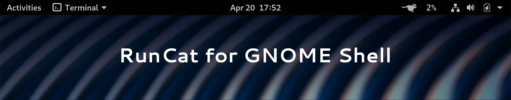

# RunCat for GNOME Shell

**RunCat** provides a key-frame animation to the GNOME Shell top bar. \
Animation speed changes depending on CPU usage.

<br />



## Installation

This is the recommended method for installation, as it doesn't require the build dependencies for installation. You can install this extension by visiting [the GNOME Shell Extensions page](https://extensions.gnome.org/extension/2986/runcat/) for this extension.

[](https://extensions.gnome.org/extension/2986/runcat/)

### Manual installation

#### From source code
If you want to install the extension from sources, clone [the RunCat repository](https://github.com/win0err/gnome-runcat), navigate to the cloned directory and run:
```bash
$ make install
```

#### Release ZIP-archive
If you want to install the extension from release zip-archive,
download `runcat@kolesnikov.se.shell-extension.zip` from [the releases section](https://github.com/win0err/gnome-runcat/releases) and run:
```bash
$ gnome-extensions install path/to/runcat@kolesnikov.se.shell-extension.zip --force
```

#### After installation:
1. Restart the GNOME Shell:
    - <kbd>ALT</kbd>+<kbd>F2</kbd> to open the command prompt, and enter <kbd>r</kbd> to restart the GNOME Shell (available on Xorg only);
    - or Log Out, then Log In, if GNOME Shell won't restart;
2. Enable the extension:
    - Open GNOME Extensions → RunCat → On;
    - or Run in terminal: `gnome-extensions enable runcat@kolesnikov.se`.


### Manage RunCat preferences
- Right-click on the extension button on the top bar → Settings;
- or Open GNOME Extensions → RunCat → ⚙️;
- or Open [RunCat on GNOME Extensions portal](https://extensions.gnome.org/extension/2986/runcat/) → ⚙️;
- or Manage directly in `dconf`: `dconf list /org/gnome/shell/extensions/runcat/`.

## Translations

### Working with existing translations

`make translations` command extracts translatable strings and updates existing translations.
Make sure that you've run this command before pushing changes.

- `make po/messages.pot` command extracts translatable strings;
- `make po/*.po` command updates existing translations.

### Starting new translation

To create a new translation file, use the following command: \
`msginit -i po/messages.pot -l <locale> --no-translator -o po/<locale>.po`.

#### Examples
**Spanish** locale: `msginit -i po/messages.pot -l es --no-translator -o po/es.po`. \
**Spanish (Argentina)** locale: `msginit -i po/messages.pot -l es_AR --no-translator -o po/es_AR.po`.

### Useful commands for developers

You need to install project JS dependencies first: `npm i`

- `npm run types:generate` — generate type definition for GJS environment;
- `npm run test:lint` — lint project files.

## macOS version
Thanks to [Takuto Nakamura](https://github.com/Kyome22/menubar_runcat) for [the macOS version](https://kyome.io/runcat/index.html) and cat images.

---
_Developed by [Sergei Kolesnikov](https://github.com/win0err)_
